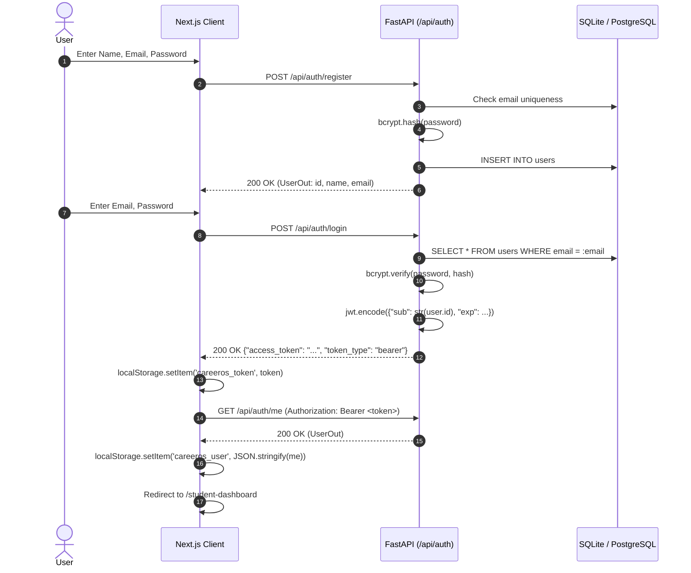
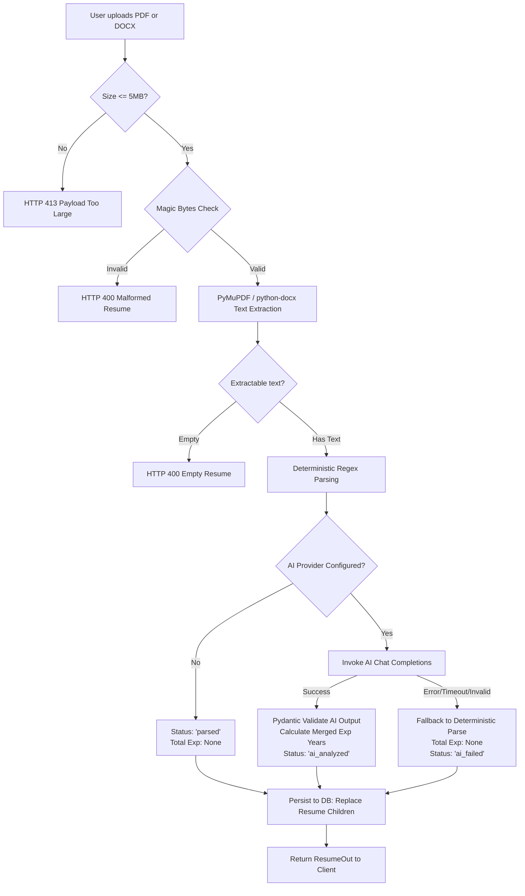
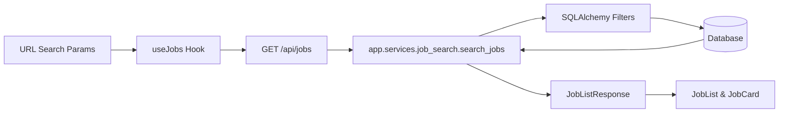
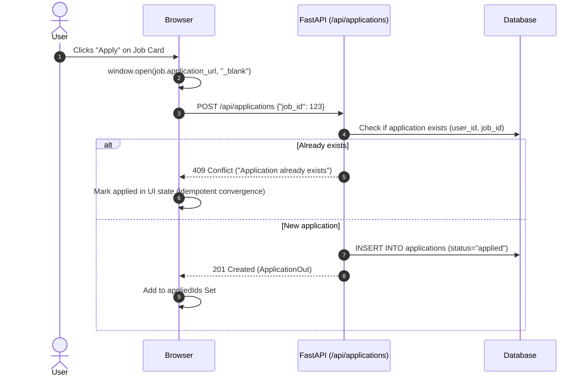
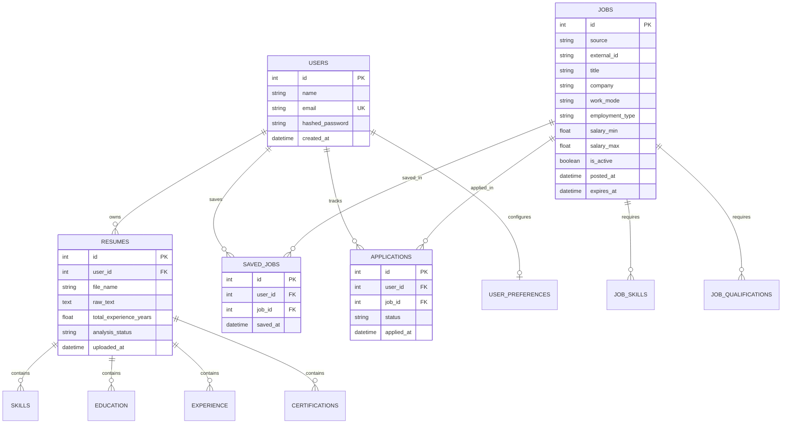
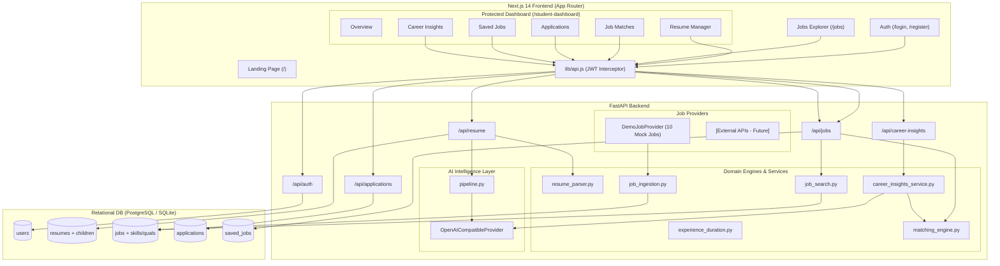

# CareerOS — Complete A–Z Codebase Inspection & Architecture Audit

**Author:** Antigravity (Advanced Agentic AI Assistant)  
**Date of Audit:** September 24, 2026  
**Audit Type:** Full Codebase Inspection, Static Analysis, Runtime Verification & Architecture Audit  
**Target Repository:** `CareerOS`  
**Execution Environment:** Windows OS, Python 3.13.7, Node.js v24.18.0, npm 11.16.0  

---

## 1. Executive Summary

A comprehensive, ground-truth inspection of the **CareerOS** codebase was conducted without altering, refactoring, or creating project code. Every claim in documentation was verified directly against implementation source code, database structures, API routes, frontend components, and runtime behavior.

### High-Level Verdict

CareerOS is an **AI-powered career discovery and job-matching platform** structured as a decoupled Next.js (App Router) frontend and FastAPI backend.

The platform exhibits an exceptionally solid engineering core:
- **Deterministic Core Engines:** The matching engine, resume parser, experience duration calculator, and career insights engine are built as pure, deterministic mathematical functions. They operate independently of LLMs, ensuring 100% reproducible scoring and zero hallucinations for factual calculations.
- **AI Integration Layer:** AI is layered purely as an enhancement/enrichment service using direct HTTP (`httpx`) to OpenAI-compatible endpoints (supporting OpenAI and Google Gemini). When AI is enabled, it extracts structured entities and drafts explanatory insights; when AI fails or is disabled, the system gracefully falls back to deterministic extraction with zero service disruption.
- **Database & Migration Health:** SQLAlchemy relational schema with 4 clean Alembic migrations at head `313a54989d0d`. `alembic check` reports zero schema drift.
- **Frontend Build Quality:** Next.js 14.2.5 compiles cleanly (`npm run build` succeeds with 0 errors across all 16 routes).
- **Backend Test Suite:** 245 unit and integration tests; **244 passed, 1 failed** (49.84s execution time). The single failure in `test_get_ai_provider_returns_gemini_provider` was isolated during this audit to a specific Pydantic configuration default collision between `AI_BASE_URL` and provider-specific fallback logic.

### Critical Implementation Realities Discovered

1. **Job Providers:** There are **zero real external job APIs connected**. The platform currently runs entirely on a built-in `DemoJobProvider` serving 10 fictional Pakistani tech job postings. `JOBS_API_KEY` is unused in code.
2. **User Profile System:** There is **no manual profile editing capability**. The database table `user_preferences` is completely unrouted and unused. The `/student-dashboard/profile` page is an explicit placeholder. All user profile data (skills, education, experience, certifications) is derived 100% from uploaded resumes.
3. **Application Tracking:** The backend supports full lifecycle tracking (`applied`, `in_review`, `interview`, `offer`, `rejected`) via `PATCH /api/applications/{id}`. `frontend/services/applicationService.js` implements `updateApplicationStatus()`. However, the frontend UI and `useApplications` hook **omit status update controls entirely** — applications can only be created via the "Apply" button and remain permanently in `applied` status on the UI.
4. **Gemini AI Provider Discrepancy:** In `backend/app/core/config.py`, `AI_BASE_URL` defaults to `"https://api.openai.com/v1"`. When `AI_PROVIDER=gemini` is selected, `app.services.ai.provider.get_ai_provider()` only overrides `base_url` if `settings.AI_BASE_URL` is empty. Because Pydantic defaults it to OpenAI, CareerOS attempts to send Gemini requests to OpenAI's endpoint, causing 401 authentication failures and falling back to `ai_failed`.

---

## 2. Product Overview

CareerOS is designed to bridge the gap between job seekers (specifically students and early-career professionals) and job openings by calculating transparent, evidence-based compatibility scores and surfacing skill gaps.

### Core Value Proposition

- **Transparent Match Scoring:** Rather than an opaque AI recommendation, CareerOS computes deterministic Skill Match % (50% weight), Qualification Match % (30% weight), and Experience Match % (20% weight), redistributing weights dynamically if job requirements are unspecified.
- **No Hallucinated Experience:** Total career experience is calculated from validated `YYYY-MM` employment dates using interval merging (handling overlaps), never trusting LLM arithmetic.
- **Actionable Gap Analysis:** In Career Insights, missing skills are ranked by market frequency across relevant active jobs, categorized into High, Medium, and Low development priority.

---

## 3. Technology Stack

### Frontend Technology Inventory

| Layer | Technology | Version | Notes |
|---|---|---|---|
| **Framework** | Next.js (App Router) | `14.2.5` | React Server Components & Client Components |
| **Runtime Library** | React & React DOM | `^18.3.1` | Native hooks (`useState`, `useEffect`, `useCallback`, `useRef`) |
| **Language** | JavaScript (ESModules) | ES2022+ | `.js` and `.jsx`, configured via `jsconfig.json` |
| **Styling** | Tailwind CSS | `^3.4.4` | Custom palette (`navy`, `accent`, `surface`, `border`) |
| **PostCSS / Autoprefixer** | PostCSS / Autoprefixer | `^8.4.38` / `^10.4.19` | Standard build pipeline |
| **Icons** | Lucide React | `^0.400.0` | Feather-style SVG icons |
| **State Management** | None (Native React) | N/A | No Redux, Zustand, or TanStack Query. State handled in custom hooks |
| **HTTP Client** | Native `fetch` wrapper | ES `fetch` | `frontend/lib/api.js` handles JWT injection, status 0 network errors, and FastAPI 422 parsing |
| **Auth Storage** | `localStorage` | Browser API | Tokens stored in `careeros_token`, user info in `careeros_user` |
| **Form Handling** | Native Controlled Forms | N/A | No React Hook Form or Formik; managed via `useState` |
| **File Upload** | Native `FormData` | N/A | Multipart upload via native `fetch` |
| **Charts** | None | N/A | Pure CSS bars and percentage radial displays |

### Backend Technology Inventory

| Layer | Technology | Version | Notes |
|---|---|---|---|
| **Web Framework** | FastAPI | `0.141.1` | Asynchronous REST API framework |
| **ASGI Server** | Uvicorn | `0.53.0` | With standard loop extensions |
| **Data Validation** | Pydantic & Pydantic-Settings | `2.13.5` / `2.15.0` | V2 validation and settings management |
| **Database ORM** | SQLAlchemy | `2.0.54` | Relational 2.0 style ORM |
| **Migration Tool** | Alembic | `1.20.0` | Database schema version control |
| **PostgreSQL Driver** | Psycopg2-binary | `2.9.13` | Supported for production deployment |
| **SQLite Driver** | Python `sqlite3` | Built-in | Used for local development and test suite |
| **Multipart Parsing** | Python-multipart | `0.0.32` | Handles resume file uploads |
| **Environment** | Python-dotenv | `1.2.3` | Loads `.env` configuration |
| **Password Hashing** | Passlib & Bcrypt | `1.7.4` / `4.0.1` | Pinned to bcrypt 4.0.1 for passlib 1.7.4 compatibility |
| **JWT Tokens** | Python-Jose [cryptography] | `3.5.0` | HS256 JWT encoding and decoding |
| **PDF Parsing** | PyMuPDF (Fitz) | `1.28.2` | High-speed C-based PDF text extraction |
| **DOCX Parsing** | Python-docx | `1.2.0` | XML paragraph and table cell text extraction |
| **Data Processing** | Pandas & NumPy | `2.3.3` / `2.3.5` | Installed in virtualenv |
| **HTTP Client (AI)** | HTTPX | `0.28.1` | Synchronous HTTP client for OpenAI/Gemini endpoints |
| **Test Framework** | Pytest | `9.1.1` | Test runner with fixtures |

---

## 4. Repository Architecture

```text
CareerOS/
├── .env.example                     # Root environment template
├── .gitignore                       # Repository ignore rules
├── docker-compose.yml               # Container definition for PostgreSQL db
├── README.md                        # Master repository documentation
├── scripts/
│   ├── setup_backend.bat            # Windows setup script for backend venv & deps
│   └── setup_frontend.bat           # Windows setup script for frontend npm install
├── data/                            # Storage for local data artifacts (.gitkeep)
│   ├── processed/
│   ├── raw/
│   └── sample/
├── docs/                            # Architectural documentation & phase reports
│   ├── API_DOCUMENTATION.md
│   ├── ARCHITECTURE.md
│   ├── AUTHENTICATION_AUDIT.md
│   ├── DATABASE_SCHEMA.md
│   ├── DEVELOPMENT_ROADMAP.md
│   ├── PHASE_0_REPORT.md through PHASE_7_3_REPORT.md
│   ├── PROJECT_OVERVIEW.md
│   ├── RESUME_UPLOAD_AUDIT.md
│   └── USER_FLOW.md
├── backend/
│   ├── .env                         # Active backend environment variables (gitignored)
│   ├── .env.example                 # Authoritative backend environment template
│   ├── alembic.ini                  # Alembic CLI configuration
│   ├── careeros.db                  # Local SQLite database (active in development)
│   ├── pytest.ini                   # Pytest configuration
│   ├── requirements.txt             # Pinned backend Python dependencies
│   ├── alembic/
│   │   ├── env.py                   # Alembic environment runner
│   │   ├── script.py.mako           # Migration template
│   │   └── versions/                # 4 schema migration versions
│   └── app/
│       ├── main.py                  # FastAPI initialization, CORS, router mounting
│       ├── cli.py                   # CLI entry point (python -m app.cli seed-jobs)
│       ├── api/
│       │   ├── deps.py              # Auth dependency get_current_user
│       │   └── routes/              # Modular API endpoints (auth, resume, jobs, etc.)
│       ├── core/
│       │   ├── config.py            # Pydantic Settings & environment validators
│       │   ├── database.py          # SQLAlchemy engine, session maker, get_db
│       │   └── security.py          # Passlib bcrypt hashing & Jose JWT functions
│       ├── models/                  # SQLAlchemy ORM declarations (User, Job, Resume, etc.)
│       ├── schemas/                 # Pydantic request/response models
│       ├── services/                # Business logic & domain computation engines
│       │   ├── ai/                  # Provider implementations, prompts, schemas, pipeline
│       │   └── providers/           # Job provider contracts & DemoJobProvider
│       └── utils/                   # Field normalizers, text processing, validators
└── frontend/
    ├── package.json                 # Dependencies & Next.js scripts
    ├── next.config.mjs              # Next.js configuration
    ├── tailwind.config.js           # Tailwind theme configuration
    ├── postcss.config.mjs           # PostCSS configuration
    ├── jsconfig.json                # Absolute import mapping (@/*)
    ├── app/                         # Next.js 14 App Router routes & layouts
    ├── components/                  # UI component library
    │   ├── applications/            # Application cards & status badges
    │   ├── auth/                    # Login & registration forms
    │   ├── career-insights/         # Visual snapshot, strengths, gaps, directions
    │   ├── dashboard/               # Overview widgets, completion tracker, stats
    │   ├── jobs/                    # Search bar, filters, list, cards, match pills
    │   ├── resume/                  # Upload form, analysis viewer, manager
    │   └── shared/                  # Navbar, footer, modal, button, loading
    ├── hooks/                       # Domain-specific client state hooks
    ├── lib/                         # Client API fetcher, auth storage, constants
    ├── services/                    # API communication modules
    └── utils/                       # Formatters & client validation
```

---

## 5. Frontend Architecture

### Routing Architecture (Next.js 14 App Router)

The frontend uses Next.js 14 App Router with nested layouts and route groups:
1. `(public)` group: Publicly accessible marketing and discovery pages (`/`, `/about`, `/contact`, `/jobs`, `/jobs/[id]`).
2. `(auth)` group: Centered authentication pages (`/login`, `/register`).
3. `student-dashboard` branch: Authenticated dashboard portal protected by `student-dashboard/layout.js`.

### Client State & React Hook Layer

No external global store exists. State is managed entirely through localized React custom hooks:
- `useAuth`: Listens to `localStorage` token, verifies with `GET /api/auth/me`, handles `signIn` and `signOut`.
- `useResume`: Manages resume analysis state, fetch via `GET /api/resume/analysis`, upload, and AI retry via `POST /api/resume/analyze`.
- `useJobs`: Controlled URL query string synchronization with `GET /api/jobs` (debounced search, filters, pagination).
- `useJobMatches`: Client-side batch matching for job cards (executes `GET /api/jobs/{id}/match` for displayed jobs).
- `useJobRecommendations`: Evaluates top 15 newest jobs, runs concurrent match requests, filters scores > 0, sorts descending, and returns top 5 recommendations.
- `useSavedJobs`: Maintains a `Set` of saved job IDs, communicates with `GET /api/jobs/saved` and `POST/DELETE /api/jobs/{id}/save`.
- `useApplications`: Maintains a `Set` of applied job IDs, communicates with `GET /api/applications` and `POST /api/applications`.
- `useCareerInsights`: Fetches `GET /api/career-insights`, separates deterministic snapshot from AI explanations.

---

## 6. Backend Architecture

### Core Pattern

FastAPI with a clean, layered architectural separation:
1. **HTTP Routing Layer (`app/api/routes/`):** FastAPI APIRouters validating inputs via Pydantic schemas, injecting dependencies (`get_db`, `get_current_user`), and raising HTTPExceptions.
2. **Dependency Layer (`app/api/deps.py`):** Resolves `Bearer` JWT tokens from `Authorization` header, decodes user ID, checks DB existence, and yields SQLAlchemy sessions with automatic teardown.
3. **Domain Engine / Pure Service Layer (`app/services/`):** Business logic decoupled from HTTP frameworks. Pure computation modules (`matching_engine.py`, `experience_duration.py`, `resume_parser.py`) do not touch the database.
4. **Data Persistence Services (`resume_service.py`, `application_service.py`, `saved_job_service.py`, `job_search.py`, `job_ingestion.py`):** Own SQLAlchemy queries, transaction flushes, and commits.
5. **Database Models (`app/models/`):** Declarative SQLAlchemy ORM entities with foreign keys and relationships.

---

## 7. Database Architecture

### Complete Relational Relationship Map

```text
User (users)
 ├── 1:N ──> Resume (resumes)
 │            ├── 1:N ──> Skill (skills)
 │            ├── 1:N ──> Education (education)
 │            ├── 1:N ──> Experience (experience)
 │            └── 1:N ──> Certification (certifications)
 │
 ├── 1:N ──> SavedJob (saved_jobs) ── N:1 ──> Job (jobs)
 │
 ├── 1:N ──> Application (applications) ── N:1 ──> Job (jobs)
 │
 └── 1:1 ──> UserPreference (user_preferences) [UNROUTED / UNUSED]

Job (jobs)
 ├── 1:N ──> JobSkill (job_skills) [ON DELETE CASCADE]
 └── 1:N ──> JobQualification (job_qualifications) [ON DELETE CASCADE]
```

### Table Definitions & Specifications

#### 1. `users`
- `id`: Integer, Primary Key, Indexed
- `name`: String, NOT NULL
- `email`: String, Unique, Indexed, NOT NULL
- `hashed_password`: String, NOT NULL
- `created_at`: DateTime, Default UTC Now

#### 2. `resumes`
- `id`: Integer, Primary Key, Indexed
- `user_id`: Integer, ForeignKey(`users.id`), NOT NULL
- `file_name`: String, NOT NULL
- `raw_text`: Text, Nullable
- `uploaded_at`: DateTime, Default UTC Now
- `total_experience_years`: Float, Nullable (derived deterministically)
- `analysis_status`: String, Default "parsed", NOT NULL ("parsed" | "ai_analyzed" | "ai_failed")

#### 3. `skills`
- `id`: Integer, Primary Key, Indexed
- `resume_id`: Integer, ForeignKey(`resumes.id`), NOT NULL
- `name`: String, NOT NULL

#### 4. `education`
- `id`: Integer, Primary Key, Indexed
- `resume_id`: Integer, ForeignKey(`resumes.id`), NOT NULL
- `institution`: String, Nullable
- `degree`: String, Nullable
- `field_of_study`: String, Nullable
- `start_year`: Integer, Nullable
- `end_year`: Integer, Nullable

#### 5. `experience`
- `id`: Integer, Primary Key, Indexed
- `resume_id`: Integer, ForeignKey(`resumes.id`), NOT NULL
- `company`: String, NOT NULL
- `title`: String, Nullable
- `description`: String, Nullable
- `location`: String, Nullable
- `start_date`: String, Nullable (Format: "YYYY-MM")
- `end_date`: String, Nullable (Format: "YYYY-MM")
- `currently_employed`: Boolean, NOT NULL, Default False

#### 6. `certifications`
- `id`: Integer, Primary Key, Indexed
- `resume_id`: Integer, ForeignKey(`resumes.id`), NOT NULL
- `name`: String, NOT NULL
- `issuer`: String, Nullable
- `issue_year`: Integer, Nullable
- `expiry_year`: Integer, Nullable

#### 7. `jobs`
- `id`: Integer, Primary Key, Indexed
- `source`: String, Nullable, Indexed
- `external_id`: String, Nullable, Indexed
- `title`: String, NOT NULL
- `company`: String, NOT NULL
- `description`: String, Nullable
- `employment_type`: String, Nullable, Indexed
- `work_mode`: String, Nullable, Indexed
- `location`: String, Nullable
- `city`: String, Nullable, Indexed
- `country`: String, Nullable
- `salary_min`: Float, Nullable
- `salary_max`: Float, Nullable
- `currency`: String, Nullable
- `application_url`: String, Nullable
- `minimum_experience_years`: Float, Nullable
- `maximum_experience_years`: Float, Nullable
- `posted_at`: DateTime, Nullable, Indexed
- `expires_at`: DateTime, Nullable
- `created_at`: DateTime, Default UTC Now
- `updated_at`: DateTime, Default UTC Now, onupdate UTC Now
- `is_active`: Boolean, Nullable, Default True, Indexed
- `fetched_at`: DateTime, Default UTC Now
- *Constraints:* Unique(`source`, `external_id`)

#### 8. `job_skills`
- `id`: Integer, Primary Key, Indexed
- `job_id`: Integer, ForeignKey(`jobs.id`, ON DELETE CASCADE), NOT NULL, Indexed
- `skill_name`: String, NOT NULL
- `normalized_name`: String, NOT NULL, Indexed
- *Constraints:* Unique(`job_id`, `normalized_name`)

#### 9. `job_qualifications`
- `id`: Integer, Primary Key, Indexed
- `job_id`: Integer, ForeignKey(`jobs.id`, ON DELETE CASCADE), NOT NULL, Indexed
- `qualification`: String, NOT NULL
- `normalized_qualification`: String, NOT NULL, Indexed
- *Constraints:* Unique(`job_id`, `normalized_qualification`)

#### 10. `saved_jobs`
- `id`: Integer, Primary Key, Indexed
- `user_id`: Integer, ForeignKey(`users.id`), NOT NULL
- `job_id`: Integer, ForeignKey(`jobs.id`), NOT NULL
- `saved_at`: DateTime, Default UTC Now
- *Constraints:* Unique(`user_id`, `job_id`)

#### 11. `applications`
- `id`: Integer, Primary Key, Indexed
- `user_id`: Integer, ForeignKey(`users.id`), NOT NULL
- `job_id`: Integer, ForeignKey(`jobs.id`), NOT NULL
- `status`: String, Default "applied" ("applied" | "in_review" | "interview" | "offer" | "rejected")
- `applied_at`: DateTime, Default UTC Now
- *Constraints:* Unique(`user_id`, `job_id`)

#### 12. `user_preferences` [EXISTING TABLE - UNUSED BY APPLICATION]
- `id`: Integer, Primary Key, Indexed
- `user_id`: Integer, ForeignKey(`users.id`), NOT NULL, Unique
- `preferred_location`: String, Nullable
- `preferred_work_mode`: String, Nullable
- `preferred_job_type`: String, Nullable

---

## 8. Authentication Flow

### Architectural Mechanics



### Auth Endpoints

1. `POST /api/auth/register`
   - **Auth Required:** No
   - **Request:** `{"name": "...", "email": "...", "password": "..."}`
   - **Response:** `{"id": 1, "name": "...", "email": "...", "created_at": "..."}`
   - **Status:** Implemented & Verified.

2. `POST /api/auth/login`
   - **Auth Required:** No
   - **Request:** `{"email": "...", "password": "..."}`
   - **Response:** `{"access_token": "...", "token_type": "bearer"}`
   - **Status:** Implemented & Verified.

3. `POST /api/auth/logout`
   - **Auth Required:** Yes
   - **Behavior:** Returns `{"message": "Logged out"}`. Note: As documented in backend comments, JWT tokens are stateless; actual token invalidation is client-side removal from `localStorage` (token blocklisting is not implemented).
   - **Status:** Implemented & Verified.

4. `GET /api/auth/me`
   - **Auth Required:** Yes
   - **Response:** `UserOut`
   - **Status:** Implemented & Verified.

### Missing Auth Features
- No password reset (`/forgot-password`, `/reset-password`).
- No email verification or activation tokens.
- No OAuth / Google Sign-in.
- No refresh token rotation (relies on long-lived 24h access tokens in `localStorage`).

---

## 9. User / Profile System

### Source-of-Truth Profile Reality

A critical discovery of this audit is that **CareerOS has no user profile editing system**.
- The `User` database model contains only `id`, `name`, `email`, `hashed_password`, and `created_at`.
- There are **no endpoints** for `PUT /api/profile`, `PATCH /api/users/me`, or `POST /api/user-preferences`.
- The database table `user_preferences` was created in migration `9032a41514cb` but has no corresponding Pydantic schema, no service functions, and no routes.
- The frontend page `/student-dashboard/profile` renders only:
  ```jsx
  <h1 className="text-2xl font-semibold text-navy">Your Profile</h1>
  <p className="mt-2 text-navy/70">
    Placeholder profile page. Populate with data from the resume/profile API.
  </p>
  ```
- **Profile Data Derivation:** The user's "profile" displayed on the dashboard (skills, education, experience, certifications) is read directly from the user's latest uploaded `Resume` record via `GET /api/resume/analysis`.

---

## 10. Resume / CV System



### Parsing Pipeline Details

1. **File Validation:**
   - Validates `.pdf` or `.docx` extensions and MIME types.
   - Validates magic bytes: `%PDF-` for PDFs, `PK` for DOCX archives.
   - File size enforced via `settings.MAX_RESUME_SIZE_MB` (default 5 MB).
2. **Text Extraction:**
   - PDF: Uses `pymupdf` (Fitz). Detects password protection and empty files.
   - DOCX: Uses `python-docx`. Iterates paragraphs and table cells, separating table columns with ` | `.
3. **Deterministic Parsing (`resume_parser.py`):**
   - Header recognition for Skills, Education, Experience, Certifications.
   - Regex-based tokenization for degrees, institutions, job titles, and certifications.
4. **AI Enrichment Pipeline (`pipeline.py`):**
   - Context window truncation (`settings.AI_MAX_RESUME_CHARS = 30000`).
   - Pydantic validation via `AIResumeExtraction`.
   - Never trusts LLM experience totals: runs deterministic `calculate_total_experience_years()` across extracted `YYYY-MM` start/end date intervals, merging overlapping and adjacent employment blocks.
5. **Persistence (`resume_service.py`):**
   - Single resume per user. Re-uploading cleanly deletes previous child rows (`skills`, `education`, `experience`, `certifications`) using `synchronize_session=False` and inserts new records within a single transaction.

### Resume Status Definitions
- `parsed`: Parsed deterministically; AI was disabled (`AI_PROVIDER=""`).
- `ai_analyzed`: Successfully analyzed and structured by the configured AI provider.
- `ai_failed`: Upload succeeded and parsed text was saved deterministically, but the AI provider timed out, rejected the key, hit rate limits, or returned unparseable output.

---

## 11. AI Architecture

### Provider Implementation

The AI architecture is entirely custom and built directly on top of `httpx` (no LangChain, no OpenAI SDK, no Google GenAI SDK).

```text
AIProvider (app.services.ai.base.AIProvider)
 ├── OpenAICompatibleProvider (app.services.ai.provider)
 │    ├── Used for OpenAI (https://api.openai.com/v1)
 │    └── Used for Gemini (https://generativelanguage.googleapis.com/v1beta/openai/)
 └── MockAIProvider (app.services.ai.provider)
      └── Used for local test suite and deterministic mocks
```

### Selection & Configuration (`app/core/config.py`)

- `AI_PROVIDER`: `""` (disabled), `"openai"`, `"gemini"`, or `"mock"`.
- `AI_API_KEY`: API authentication key.
- `AI_MODEL`: Defaults to `gpt-4o-mini`.
- `AI_BASE_URL`: Defaults to `https://api.openai.com/v1`.
- `AI_TIMEOUT_SECONDS`: Request timeout (default 30s).
- `AI_MAX_RESUME_CHARS`: Prompt cap (default 30,000 characters).

### The Gemini Discrepancy & Root Cause Analysis

In `backend/app/services/ai/provider.py`:
```python
def get_ai_provider() -> AIProvider | None:
    ...
    base_url = (settings.AI_BASE_URL or "").strip()
    model = (settings.AI_MODEL or "").strip()

    if name == "gemini":
        if not base_url:
            base_url = PROVIDER_GEMINI_BASE_URL
        if not model:
            model = GEMINI_DEFAULT_MODEL

    if not base_url:
        base_url = "https://api.openai.com/v1"
```
**The Flaw:** In `app/core/config.py`, `Settings.AI_BASE_URL` is initialized with the default value `"https://api.openai.com/v1"`. Therefore, `settings.AI_BASE_URL` is **never empty** unless explicitly set to empty in `.env`.
When an operator configures:
```bash
AI_PROVIDER=gemini
AI_API_KEY=AIzaSy...
```
`base_url` evaluates to `"https://api.openai.com/v1"`. The conditional `if not base_url:` evaluates to `False`, and Gemini's base URL is never applied.
Consequently, requests for Gemini models are dispatched to OpenAI's servers with a Google API key, resulting in HTTP 401 errors. This is why test `test_get_ai_provider_returns_gemini_provider` fails and why the user's uploaded CV showed `ai_failed`.

---

## 12. Job System & Provider Architecture

### Ingestion & Deduplication

Jobs are ingested via `app.services.job_ingestion.ingest_jobs()`.
- Deduplication is guaranteed at the database level by `UniqueConstraint("source", "external_id")`.
- When re-ingesting an existing job, an MD5-style tuple comparison of mutable fields detects whether changes occurred. If unchanged, the record is marked `skipped`; if changed, existing children (`job_skills`, `job_qualifications`) are cleared and updated.

### Active Job Provider Reality

- **Real Job APIs:** **Zero.** There are no integrations with LinkedIn, Indeed, Adzuna, Reed, or greenhouse.
- **Active Provider:** `DemoJobProvider` (`app/services/providers/demo.py`).
- **Data Source:** A static Python list of 10 fictional Pakistani jobs (`demo-01` to `demo-10`) with companies like "DataWorks Pakistan", "Insight Analytics", and "TechNova".
- **Database State:** The local development SQLite database (`careeros.db`) contains **0 jobs**. It has not yet been seeded using `python -m app.cli seed-jobs`.

---

## 13. Job Search & Filtering



### Filter Capabilities & Verification

| Filter | Frontend Control | Backend Query Param | SQL Implementation | Status |
|---|---|---|---|---|
| **Free-text Search** | Text input (`JobSearch`) | `search` | `ilike` over title, company, description, location, and joined skills | Verified Working |
| **Location** | Text input (`JobFilters`) | `location` | `ilike` over `jobs.location` | Verified Working |
| **City** | Text input (`JobFilters`) | `city` | `ilike` over `jobs.city` | Verified Working |
| **Work Mode** | Select dropdown | `work_mode` | Exact match against `remote`, `hybrid`, `onsite` | Verified Working |
| **Employment Type** | Select dropdown | `employment_type` | Exact match (`full-time`, `contract`, `internship`, etc.) | Verified Working |
| **Salary Minimum** | Number input | `salary_min` | `jobs.salary_max >= salary_min` | Verified Working |
| **Salary Maximum** | Number input | `salary_max` | `jobs.salary_min <= salary_max` | Verified Working |
| **Source** | Text input | `source` | Exact match (e.g. `demo`) | Verified Working |
| **Inactive / Expired** | Hidden toggle | `include_inactive` | `is_active == True` and `expires_at > now` | Verified Working |
| **Sort** | Select dropdown | `sort` | `date_newest`, `date_oldest`, `salary_desc` | Verified Working |
| **Pagination** | Pagination nav | `page`, `page_size` | `offset((page - 1) * page_size).limit(page_size)` | Verified Working |

---

## 14. Matching Engine

The matching engine (`app/services/matching_engine.py`) is completely deterministic. It executes no database queries, calls no external APIs, and contains zero randomness.

### Detailed Mathematical Formulations

#### 1. Skill Match
$$\text{Skill Match \%} = \frac{|\text{Candidate Skills} \cap \text{Required Job Skills}|}{|\text{Required Job Skills}|} \times 100$$
- Normalization: Case-insensitive, whitespace-trimmed, punctuation stripped.
- If the job lists **no required skills**, the score is `None` (unknown).
- If the candidate possesses no matching skills, the score is `0.0%`.

#### 2. Qualification Match
$$\text{Qualification Match \%} = \frac{|\text{Candidate Qualifications} \cap \text{Required Qualifications}|}{|\text{Required Qualifications}|} \times 100$$
- Candidate qualifications include: `degree`, `field_of_study`, `"{degree} in {field_of_study}"`, and `certification.name`.
- If the job lists **no qualifications**, the score is `None` (unknown).

#### 3. Experience Match
Evaluated against `minimum_experience_years` ($Y_{\min}$) and `maximum_experience_years` ($Y_{\max}$):
- **Within Window ($Y_{\min} \le Y_{\text{cand}} \le Y_{\max}$):** $100.0\%$, Status: `meets_requirement`.
- **Below Minimum ($Y_{\text{cand}} < Y_{\min}$):** $\frac{Y_{\text{cand}}}{Y_{\min}} \times 100$, Status: `below_minimum`.
- **Above Maximum ($Y_{\text{cand}} > Y_{\max}$):** $\frac{Y_{\max}}{Y_{\text{cand}}} \times 100$, Status: `above_maximum`.
- If job specifies neither $Y_{\min}$ nor $Y_{\max}$: Status `no_requirement`, score is `None`.
- If candidate experience cannot be reliably calculated from resume: Status `unknown`, score is `None`.

#### 4. Overall Weighted Match
$$\text{Overall Match \%} = \frac{\sum_{i \in \text{Known}} W_i \times S_i}{\sum_{i \in \text{Known}} W_i}$$
Nominal weights:
- $W_{\text{skill}} = 0.50$ (50%)
- $W_{\text{qualification}} = 0.30$ (30%)
- $W_{\text{experience}} = 0.20$ (20%)
If any component $S_i$ is `None`, its weight is dynamically excluded from the denominator, redistributing weight proportionally among known components. If all components are `None`, overall score is `None`.

---

## 15. Saved Jobs System

### Trace: User Clicks Save $\to$ Unsave

1. **Save Action:**
   - Client triggers `POST /api/jobs/{job_id}/save`.
   - Requires valid JWT.
   - Backend queries `jobs` table; returns 404 if missing.
   - Queries `saved_jobs` for `(user_id, job_id)`. If exists, returns 409 Conflict.
   - Creates `SavedJob(user_id=current_user.id, job_id=job_id)`, commits, and returns 201 Created (`SavedJobOut`).
   - Frontend `useSavedJobs` optimistically adds `job_id` to its local `savedIds` Set.
2. **Reviewing Saved Jobs:**
   - Navigating to `/student-dashboard/saved-jobs` calls `GET /api/jobs/saved`.
   - Backend eager-loads the associated `Job` and returns `list[SavedJobOut]`.
3. **Unsave Action:**
   - Client clicks the bookmark icon again, issuing `DELETE /api/jobs/{job_id}/save`.
   - Backend executes `delete_saved_job()`, committing the deletion and returning 204 No Content (idempotent).

---

## 16. Application Tracking System

### End-to-End Application Flow



### Missing Frontend Feature Identified

The backend API explicitly provides:
`PATCH /api/applications/{application_id}` with payload `{"status": "applied" | "in_review" | "interview" | "offer" | "rejected"}`.
The frontend service `frontend/services/applicationService.js` contains:
```javascript
export async function updateApplicationStatus(id, status) {
  return apiFetch(`/api/applications/${id}`, {
    method: "PATCH",
    body: JSON.stringify({ status }),
  });
}
```
However, **no component or hook in the frontend ever calls this function**. The `useApplications` hook lacks an `updateStatus` method, and `ApplicationCard.jsx` only displays a static status badge without any dropdown or edit action. Status editing from the frontend is **pending/missing**.

---

## 17. Career Insights System

The Career Insights endpoint (`GET /api/career-insights`) executes on the fly:

1. **Profile Snapshot:** Formed from stored user resume (`skills`, `education`, `certifications`, `experience`).
2. **Job Sample:** Fetches up to 30 active jobs via `search_jobs(include_inactive=False)`.
3. **Relevance Filtering:** Evaluates candidate against each job using `match_resume_to_job()`. A job is relevant if candidate matches $\ge 1$ skill or qualification (capped at top 20 relevant jobs).
4. **Strengths:** Verified user skills required by relevant jobs, sorted by frequency.
5. **Skill Gaps:** Skills required by relevant jobs that the candidate lacks. Priority assigned deterministically:
   - High Priority: Appears in $\ge 60\%$ of maximum gap frequency.
   - Medium Priority: Appears in $\ge 33\%$ of maximum gap frequency.
   - Low Priority: Below 33%.
6. **Career Directions:** Groups relevant jobs by normalized title, averaging match scores and listing supporting vs missing skills.
7. **Action Plan & Suggestions:** Rule-based deterministic text generation.
8. **AI Enrichment (`_run_ai_career_insights`):**
   - Sends the deterministic payload to the LLM.
   - Strict hallucination guard: Any skill mentioned in AI `skill_development` that is not in the verified user skills or deterministic skill gaps is stripped out.
   - If AI fails, returns `status: "failed"` with empty fields while all deterministic data renders normally.

---

## 18. Dashboard System

The student dashboard (`/student-dashboard`) is composed of 8 modular sections driven by 5 backend endpoints:

| Section | Backend Data Source | Computation / Logic | Real vs Mock |
|---|---|---|---|
| **Profile Summary** | `GET /api/auth/me` & `GET /api/resume/analysis` | Name, email, experience years, skills count | Real |
| **Profile Completion** | Local helper (`profileCompletion.js`) | 6 equal checks: account, resume, skills, edu, exp, certs | Real |
| **Resume Status** | `GET /api/resume/analysis` | Displays status (`parsed`, `ai_analyzed`, `ai_failed`), upload date, retry button | Real |
| **Recommended Jobs** | `GET /api/jobs` + `GET /api/jobs/{id}/match` | Fetches 15 candidate jobs, evaluates match for each, filters score > 0, sorts descending, displays top 5 | Real (Client-orchestrated) |
| **Application Stats** | `GET /api/applications` | Aggregates counts by status (Applied, Review, Interview, Offer, Rejected) | Real |
| **Recent Applications** | `GET /api/applications` | Displays latest 3 applications with status badges | Real |
| **Saved Jobs Summary** | `GET /api/jobs/saved` | Displays total saved count and latest 3 saved job items | Real |
| **Career Overview** | `GET /api/resume/analysis` | Top skills pills, education degree, experience duration | Real |

---

## 19. Complete Frontend Route Map

| Route Path | File Location | Auth Required | Real vs Mock Data | Purpose / Primary Components |
|---|---|---|---|---|
| `/` | `frontend/app/page.js` | No | Static marketing copy + interactive UI mock card | Landing page, hero, platform features, how-it-works, CTA |
| `/(public)/about` | `frontend/app/(public)/about/page.js` | No | Static placeholder | Generic placeholder copy about CareerOS |
| `/(public)/contact` | `frontend/app/(public)/contact/page.js` | No | Static placeholder | Generic placeholder contact information |
| `/(public)/jobs` | `frontend/app/(public)/jobs/page.js` | No | Real (`GET /api/jobs`) | Public job explorer, search, filter modal, pagination |
| `/(public)/jobs/[id]` | `frontend/app/(public)/jobs/[id]/page.js` | No | Real (`GET /api/jobs/{id}`) | Full job description, match card (if signed in), apply button |
| `/(auth)/login` | `frontend/app/(auth)/login/page.js` | No | Real (`POST /api/auth/login`) | Email/password sign-in form |
| `/(auth)/register` | `frontend/app/(auth)/register/page.js` | No | Real (`POST /api/auth/register`) | Name/email/password registration form |
| `/api/health` | `frontend/app/api/health/route.js` | No | Real Next.js route | Next.js server health check |
| `/student-dashboard` | `frontend/app/student-dashboard/page.js` | Yes | Real (Composed of 5 APIs) | Master personalized overview dashboard |
| `/student-dashboard/jobs` | `frontend/app/student-dashboard/jobs/page.js` | Yes | Real (`GET /api/jobs` + `/match`) | Dashboard version of jobs explorer with match pills |
| `/student-dashboard/profile` | `frontend/app/student-dashboard/profile/page.js` | Yes | **PLACEHOLDER** | Static placeholder card; no profile editing form |
| `/student-dashboard/resume` | `frontend/app/student-dashboard/resume/page.js` | Yes | Real (`/api/resume/*`) | Resume upload, extracted data view, AI analysis retry |
| `/student-dashboard/saved-jobs` | `frontend/app/student-dashboard/saved-jobs/page.js` | Yes | Real (`GET /api/jobs/saved`) | View saved jobs list, inline remove / unsave |
| `/student-dashboard/applications` | `frontend/app/student-dashboard/applications/page.js` | Yes | Real (`GET /api/applications`) | Tracked applications list with status badges |
| `/student-dashboard/career-insights` | `frontend/app/student-dashboard/career-insights/page.js` | Yes | Real (`GET /api/career-insights`) | Strengths, market skill gaps, directions, AI insights |

---

## 20. Complete Backend API Inventory

| Method | Endpoint | Auth | Purpose | Request Body | Response Body | Frontend Consumer | Status |
|---|---|---|---|---|---|---|---|
| `GET` | `/` | No | Root service status | None | `{"message": "..."}` | None (Browser/ping) | Verified |
| `GET` | `/api/health` | No | Health check probe | None | `{"status": "ok", "service": "backend"}` | Monitoring | Verified |
| `POST` | `/api/auth/register` | No | Register new user | `UserCreate` (name, email, password) | `UserOut` | `RegisterForm.jsx` | Verified |
| `POST` | `/api/auth/login` | No | Authenticate & get JWT | `UserLogin` (email, password) | `Token` (access_token) | `LoginForm.jsx` | Verified |
| `POST` | `/api/auth/logout` | Yes | Stateless logout | None | `{"message": "Logged out"}` | `Navbar.jsx` | Verified |
| `GET` | `/api/auth/me` | Yes | Get current user | None | `UserOut` | `useAuth.js` | Verified |
| `POST` | `/api/resume/upload` | Yes | Upload & parse resume | Multipart `file` (PDF/DOCX) | `ResumeOut` | `ResumeUpload.jsx` | Verified |
| `POST` | `/api/resume/analyze` | Yes | Re-run AI analysis | None | `ResumeOut` | `ResumeManager.jsx` | Verified |
| `GET` | `/api/resume/analysis` | Yes | Get parsed resume data | None | `ResumeOut` | `useResume.js` | Verified |
| `GET` | `/api/jobs` | No | Search & filter jobs | Query params (search, location, etc.) | `JobListResponse` | `useJobs.js` | Verified |
| `GET` | `/api/jobs/saved` | Yes | List user's saved jobs | None | `list[SavedJobOut]` | `useSavedJobs.js` | Verified |
| `GET` | `/api/jobs/{job_id}` | No | Get single job details | Path param `job_id` | `JobResponse` | `JobDetailView.jsx` | Verified |
| `GET` | `/api/jobs/{job_id}/match` | Yes | Match user resume to job | Path param `job_id` | `JobMatchResponse` | `useJobMatch.js` | Verified |
| `POST` | `/api/jobs/{job_id}/save` | Yes | Save job to favorites | Path param `job_id` | `SavedJobOut` | `SaveJobButton.jsx` | Verified |
| `DELETE` | `/api/jobs/{job_id}/save` | Yes | Unsave job | Path param `job_id` | 204 No Content | `SaveJobButton.jsx` | Verified |
| `POST` | `/api/matching` | No | Legacy stateless match | `MatchRequest` (raw string lists) | `MatchResponse` | None (Deprecated) | Legacy/Stub |
| `GET` | `/api/applications` | Yes | List user applications | None | `list[ApplicationOut]` | `useApplications.js` | Verified |
| `POST` | `/api/applications` | Yes | Track job application | `ApplicationCreate` (job_id) | `ApplicationOut` | `ApplyNowButton.jsx` | Verified |
| `PATCH` | `/api/applications/{id}` | Yes | Update application status | `ApplicationStatusUpdate` (status) | `ApplicationOut` | **None (Missing in UI)** | Verified Backend |
| `GET` | `/api/career-insights` | Yes | Compute career insights | None | `CareerInsightsResponse` | `useCareerInsights.js`| Verified |

---

## 21. Database Schema Map



---

## 22. Alembic Migration Status

The migration history in `backend/alembic/versions/` consists of 4 linear migrations:

1. `9032a41514cb_initial_schema.py`
   - Initial creation of `users`, `jobs`, `resumes`, `skills`, `education`, `experience`, `certifications`, `saved_jobs`, `applications`, `user_preferences`.
2. `bf773dd3d573_phase1_job_system.py`
   - Renamed `jobs.job_type` $\to$ `employment_type` and `jobs.apply_url` $\to$ `application_url`.
   - Added `city`, `country`, `is_active`, `minimum_experience_years`, `maximum_experience_years`.
   - Created `job_skills` and `job_qualifications` child tables. Added Unique(`source`, `external_id`).
3. `c821c44ae290_phase3_resume_ai.py`
   - Added `resumes.total_experience_years` and `resumes.analysis_status`.
   - Added `education.start_year`, `end_year`; made `institution` nullable.
   - Added `experience.start_date`, `end_date`, `currently_employed`, `location`.
   - Added `certifications.issue_year`, `expiry_year`.
4. `313a54989d0d_reconcile_schema_drift.py`
   - Reconciled schema drift from early `create_all()` runs. Added missing unique constraints and indexes safely.

**Runtime Status:**
- Current Revision Head: `313a54989d0d (head)`
- `alembic check` command execution output: `No new upgrade operations detected.` (Zero drift).

---

## 23. Test Coverage & Pytest Audit

**Execution Result:** `1 failed, 244 passed, 613 warnings in 49.84s` across 17 test modules.

### Detailed Test Module Breakdown

| Test File | Test Count | Status | Notes |
|---|---|---|---|
| `test_auth.py` | 24 | Passed | Registration, login, duplicate email, JWT decode, password hashing |
| `test_health.py` | 2 | Passed | Health endpoint check |
| `test_resume.py` | 17 | Passed | PDF/DOCX parsing, empty file, child record replacement |
| `test_ai_resume_pipeline.py` | 33 | **1 Failed**, 32 Passed | Extraction, mock provider, validation, duration calculation |
| `test_jobs_api.py` | 26 | Passed | Filtering, sorting, pagination, search |
| `test_job_fields.py` | 15 | Passed | Normalization, dates, expiry logic |
| `test_job_ingestion.py` | 16 | Passed | Upsert, deduplication, field updates |
| `test_job_normalizer.py` | 11 | Passed | ProviderJob $\to$ NormalizedJob conversion |
| `test_job_providers.py` | 10 | Passed | Demo provider contract and data validation |
| `test_matching_engine.py` | 32 | Passed | Pure math unit tests for skill, qual, exp, overall |
| `test_matching.py` | 12 | Passed | Legacy matching endpoints |
| `test_job_match_api.py` | 14 | Passed | `GET /api/jobs/{id}/match` route tests |
| `test_saved_jobs_api.py` | 10 | Passed | Save, unsave, duplicate save, list saved |
| `test_applications_api.py` | 8 | Passed | Apply, list, duplicate apply, patch status |
| `test_experience_duration.py` | 10 | Passed | Interval merging, date parsing, edge cases |
| `test_career_insights_api.py` | 14 | Passed | Deterministic insights, gap priority, fallback |
| `test_migrations.py` | 1 | Passed | Migration integrity test |

### The Failing Test

`FAILED backend/tests/test_ai_resume_pipeline.py::test_get_ai_provider_returns_gemini_provider`
- **Assertion:** `assert provider._base_url == PROVIDER_GEMINI_BASE_URL`
- **Value Received:** `'https://api.openai.com/v1'`
- **Root Cause:** As detailed in Section 11, `settings.AI_BASE_URL` defaults to OpenAI's URL in `app/core/config.py`, preventing the Gemini fallback branch from executing unless `AI_BASE_URL` is explicitly cleared.

---

## 24. Security Audit

| Finding | Severity | Description | Recommendation |
|---|---|---|---|
| **Hardcoded Dev JWT Fallback** | Medium | `DEV_ONLY_JWT_SECRET` in `config.py` is used when `JWT_SECRET` is unset in development. (Mitigated: config strictly raises `ValueError` if `ENVIRONMENT=production`). | Enforce setting `JWT_SECRET` in `.env` for all environments. |
| **JWT Stored in LocalStorage** | Low-Medium | Tokens stored in browser `localStorage` are vulnerable to XSS. | Migrate to `httpOnly`, `Secure`, `SameSite=Lax` cookies with a refresh token route. |
| **Stateless Logout** | Low | `POST /api/auth/logout` does not invalidate the JWT server-side; it only returns a message. | Implement a Redis token blocklist or short-lived tokens. |
| **Permissive File Extension Acceptance** | Low | Uploads accept `.pdf` and `.docx`. (Mitigated: PyMuPDF and python-docx validate magic bytes and archive structures). | Maintain current magic bytes checks and enforce virus scanning in production. |
| **CORS Origins** | Low | Explicitly restricted to `localhost:3000`, `3001`, `127.0.0.1:3000`, `3001`. No wildcard origin with credentials. | Add production domain to `ALLOWED_ORIGINS` upon deployment. |
| **SQL Injection Risk** | Informational | Fully mitigated by SQLAlchemy parameterized ORM queries. | None. |

---

## 25. Error Handling Audit

- **FastAPI Validation Errors (422):** `frontend/lib/api.js` intercepts FastAPI 422 array responses and formats them into readable strings (e.g. `detailFromBody()`).
- **Session Expiry (401):** Authenticated requests receiving a 401 prompt the message: `"Your session has expired. Please sign in again."` and trigger client-side auth cleanup.
- **Backend Unreachable (Status 0):** Network failures or CORS blocks are caught in `api.js` and surface: `"Unable to connect to CareerOS API. Please check that the backend is running."`
- **AI Failures:** Upload never fails when the AI provider times out or errors. Analysis falls back to deterministic extraction with status `ai_failed`.

---

## 26. UI / UX Completeness

- **Responsive Design:** Public navbar, mobile filter drawer modal, responsive grid columns (`md:grid-cols-2`, `xl:grid-cols-3`).
- **Loading States:** Implemented across all pages using pulse skeletons (`JobCardSkeleton`, `DashboardSkeleton`, `CareerInsightsSkeleton`).
- **Empty States:** Implemented via `<EmptyState />` for Saved Jobs, Applications, Career Insights, and Resume Manager.
- **Unfinished UI / Placeholders:**
  - `/student-dashboard/profile`: Completely placeholder text. No input fields.
  - `/about`: Placeholder copy.
  - `/contact`: Placeholder copy.
  - `ApplicationCard`: Lacks status dropdown or edit controls.

---

## 27. TODO & Placeholder Audit

Results of static scan across codebase:

1. `backend/app/services/ai_service.py`:
   - Contains deprecated placeholders (`_call_llm`, `analyze_resume_text`) raising `NotImplementedError`. Superseded by `app.services.ai.*`.
2. `frontend/app/student-dashboard/profile/page.js`:
   - Text explicitly notes: `"Placeholder profile page. Populate with data from the resume/profile API."`
3. `frontend/app/(public)/about/page.js` & `contact/page.js`:
   - Text explicitly notes placeholder status.
4. `frontend/services/applicationService.js` & `resumeService.js`:
   - Top-level comments say `"Placeholder ... service. Connect to backend routes."` (Code itself is actually fully connected).

---

## 28. Feature Status Matrix

| Feature | Frontend | Backend | Database | API Route | Test Coverage | Implementation Type | Status |
|---|---|---|---|---|---|---|---|
| **Registration** | Complete | Complete | Complete | `POST /api/auth/register` | Tested | Real | ✅ Working |
| **Login** | Complete | Complete | Complete | `POST /api/auth/login` | Tested | Real | ✅ Working |
| **Logout** | Complete | Partial | N/A | `POST /api/auth/logout` | Tested | Stateless | 🟡 Partial |
| **User Profile Editing** | Missing | Missing | Exists (`user_preferences`) | None | Untested | None | 🔴 Missing |
| **Resume Upload (PDF/DOCX)**| Complete | Complete | Complete | `POST /api/resume/upload` | Tested | Real | ✅ Working |
| **Deterministic Resume Parse**| Complete | Complete | Complete | Internal service | Tested | Real | ✅ Working |
| **AI Resume Analysis** | Complete | Complete | Complete | `POST /api/resume/analyze` | Tested | Real (OpenAI/Gemini)| ⚠️ Working (Needs Gemini config fix) |
| **Experience Duration Calc** | Complete | Complete | Complete | Internal service | Tested | Real | ✅ Working |
| **Job Search & Filters** | Complete | Complete | Complete | `GET /api/jobs` | Tested | Real | ✅ Working |
| **Job Details View** | Complete | Complete | Complete | `GET /api/jobs/{id}` | Tested | Real | ✅ Working |
| **Deterministic Matching** | Complete | Complete | Complete | `GET /api/jobs/{id}/match`| Tested | Real | ✅ Working |
| **Saved Jobs (Save/Unsave)** | Complete | Complete | Complete | `POST/DELETE /api/jobs/{id}/save`| Tested | Real | ✅ Working |
| **Apply (External Redirect)**| Complete | Complete | Complete | `POST /api/applications` | Tested | Real | ✅ Working |
| **Application Tracking** | Read-Only | Complete | Complete | `PATCH /api/applications/{id}` | Tested | Real | 🟡 Partial (UI missing edit) |
| **Dashboard Overview** | Complete | Complete | Complete | Composed of 5 APIs | Tested | Real | ✅ Working |
| **Job Recommendations** | Complete | Client Batch | Complete | `GET /api/jobs` + `/match` | Tested | Real | 🟡 Working (High request count) |
| **Career Insights (Snapshot)**| Complete | Complete | N/A | `GET /api/career-insights` | Tested | Real | ✅ Working |
| **Career Insights (AI)** | Complete | Complete | N/A | `GET /api/career-insights` | Tested | Real | ⚠️ Working (Needs Gemini config fix) |
| **External Job Sync** | None | Stub | DB Ready | `JobProvider` | Tested (Demo) | Mock/Demo | 🔵 Mock Only (10 Demo Jobs) |
| **Password Reset** | None | None | None | None | Untested | None | 🔴 Missing |
| **Email Verification** | None | None | None | None | Untested | None | 🔴 Missing |

---

## 29. API Gap Analysis

### Required Next APIs (High Priority)
1. `GET /api/profile` & `PUT /api/profile`:
   - *Reason:* Allow users to manually view, edit, and enrich their name, location, headline, bio, and job preferences without having to re-upload a resume.
2. `DELETE /api/resume`:
   - *Reason:* Allow users to delete their stored resume, raw text, and extracted child entities for privacy and GDPR compliance.
3. `POST /api/jobs/sync` or `POST /api/jobs/ingest`:
   - *Reason:* An administrative endpoint to trigger job fetching from external providers on a scheduled or on-demand basis.

### Nice-to-Have APIs (Medium Priority)
1. `POST /api/jobs/recommendations`:
   - *Reason:* Server-side recommendation endpoint that scores and orders candidate jobs in the database/backend, eliminating the need for the frontend to fire 15 parallel HTTP match requests.
2. `POST /api/auth/forgot-password` & `POST /api/auth/reset-password`:
   - *Reason:* Standard password recovery flow via email tokens.

---

## 30. Feature Gap Analysis

### Implemented & Verified
- JWT Registration, Login, and `/api/auth/me`.
- PDF and DOCX resume file validation, text extraction, and deterministic parsing.
- Experience duration calculation via interval merging.
- Complete deterministic matching engine (Skill, Qualification, Experience, Overall).
- Public and Dashboard Job Explorers with full query-string synchronized filtering, search, and pagination.
- Saved jobs persistence (Save, Unsave, List).
- Application creation upon clicking "Apply".
- Career Insights deterministic profile snapshot, market strengths, and prioritized skill gaps.
- Master student dashboard composing real data.

### Partially Implemented
- **Application Tracking:** Backend supports `PATCH` status updates, frontend service has the method, but the UI has no controls to update application statuses.
- **Logout:** Client-side only; no server-side token revocation.
- **Recommendations:** Fully functional on UI, but implemented as client-side multi-request fanout rather than a single server-side recommendation engine.

### Mock / Demo Only
- **Job Ingestion:** Only `DemoJobProvider` exists, supplying 10 mock Pakistani job postings. No live external API is connected.

### Broken / Needs Fix
- **Gemini Provider Configuration:** Pydantic default `AI_BASE_URL="https://api.openai.com/v1"` overrides the Gemini endpoint fallback, breaking Gemini chat completions unless explicitly overridden in `.env`.

### Missing
- User profile editing UI and backend routes.
- Password reset and email verification.
- Resume deletion endpoint.

---

## 31. Current Limitations

1. **No Real Job Data:** Users cannot find live, real-world job postings. Jobs are limited to 10 static demo listings.
2. **No Manual Profile Editing:** If the resume parser extracts a skill name incorrectly or misses a degree, the user cannot manually edit their profile.
3. **Application Lifecycle Frozen on UI:** Users cannot update an application from "Applied" to "Interview" or "Offer" on the dashboard.
4. **Client-Side Recommendation Fanout:** Fetching recommendations requires 16 HTTP requests (1 job search + 15 match requests) every time the dashboard loads.
5. **No Password Reset:** Users who forget their password have no recovery mechanism.

---

## 32. End-to-End Architecture & Data Flow Diagrams

### Complete System Architecture



---

## 33. Production Readiness Assessment

### 1. Production-Ready Components
- **Deterministic Matching Engine:** Rock-solid, mathematically sound, zero external dependencies.
- **Resume Text Extractor & Duration Calculator:** Conservative, safe, handles corrupt files and interval overlaps.
- **Database Schema & Migrations:** Clean Alembic history, proper indexes, foreign key constraints, unique dedup keys.
- **Authentication Core:** Secure bcrypt hashing, standard JWT encoding and token verification.

### 2. Development-Only Components
- **Database:** Local deployment runs on `careeros.db` SQLite file. Production requires pointing `DATABASE_URL` to PostgreSQL.
- **Demo Job Provider:** Generates mock postings; not suitable for a live commercial release.

### 3. Components Requiring External Credentials
- **AI Intelligence:** Requires valid `OPENAI_API_KEY` or `GEMINI_API_KEY`.
- **Job Ingestion:** Requires real job API credentials (e.g. Adzuna, Reed, RapidAPI).

### 4. Components Requiring Code Fixes Prior to Deploy
- **Gemini Provider Base URL:** Fix `app/core/config.py` default so `get_ai_provider()` correctly applies the Google Gemini endpoint.
- **Application Status Editing UI:** Add status dropdown on `ApplicationCard.jsx` connecting to `PATCH /api/applications/{id}`.
- **Profile Page:** Replace `/student-dashboard/profile` placeholder with real editing UI.

---

## 34. Recommended Development Sequence

```mermaid
flowchart TD
    P1[Phase 1: Fix Gemini Provider Base URL & Verify Tests] --> P2[Phase 2: Add Application Status Editing to Frontend UI]
    P2 --> P3[Phase 3: Implement User Profile Editing & Preferences Endpoints]
    P3 --> P4[Phase 4: Connect Real External Job Provider (e.g. Adzuna)]
    P4 --> P5[Phase 5: Implement Server-Side Job Recommendation API]
    P5 --> P6[Phase 6: Auth Hardening (Password Reset & httpOnly Cookies)]
    P6 --> P7[Phase 7: Production Deployment (PostgreSQL + Docker + Vercel)]
```

### Detailed Phase Execution Plan

#### Phase 1: Gemini Provider Fix & Gate Green (Immediate)
- **Goal:** Reach 100% test pass rate (245/245).
- **Action:** Update `app/core/config.py` so `AI_BASE_URL` is empty by default (or dynamically resolved based on `AI_PROVIDER`).
- **Dependency:** None.

#### Phase 2: Application Tracking UI Completion
- **Goal:** Complete the application management flow.
- **Action:** Add `updateStatus` to `useApplications.js` and render an interactive status selector on `ApplicationCard.jsx`.
- **Dependency:** Backend route already exists and is tested.

#### Phase 3: Profile & Preferences System
- **Goal:** Allow user-directed profile management without resume re-uploads.
- **Action:** Create `GET /api/profile` and `PUT /api/profile` routes, hook up `user_preferences` table, and replace the placeholder `/student-dashboard/profile` page.
- **Dependency:** DB table already exists.

#### Phase 4: Live Job Provider Ingestion
- **Goal:** Transition from demo jobs to real market opportunities.
- **Action:** Implement an `AdzunaJobProvider` or `RapidAPIJobProvider` subclassing `JobProvider` in `app/services/providers/`.
- **Dependency:** Requires external API keys.

#### Phase 5: Server-Side Recommendations
- **Goal:** Optimize dashboard performance.
- **Action:** Create `GET /api/jobs/recommendations` on the backend to score and rank top jobs inside Python/SQL, reducing client requests from 16 to 1.
- **Dependency:** Phase 4.

---

## 35. Most Important Final Section: Current State & Workflow

```text
CURRENTLY WORKING
-----------------
1. User registration with bcrypt password hashing (POST /api/auth/register).
2. User login with JWT access token generation (POST /api/auth/login).
3. Current user resolution and session persistence (GET /api/auth/me).
4. PDF and DOCX resume upload with magic-bytes validation (POST /api/resume/upload).
5. Deterministic resume parsing for skills, education, experience, and certifications.
6. Deterministic employment duration calculation with interval overlap merging.
7. Pure deterministic matching engine calculating Skill %, Qualification %, Experience %, and Overall %.
8. Full public and dashboard job browsing with search, multi-field filters, sorting, and pagination (GET /api/jobs).
9. Single job detail view with embedded skills and qualifications (GET /api/jobs/{id}).
10. Saved jobs end-to-end (Save, Unsave, List saved).
11. External application tracking trigger (clicking Apply tracks job in DB and opens external URL).
12. Career Insights deterministic profile snapshot, strengths, and prioritized skill gaps.
13. Complete personalized student dashboard composing real profile, resume, saved jobs, and applications.
14. Complete Next.js frontend build (16 routes compile cleanly without errors).
15. Alembic migrations (4 versions applied, head at 313a54989d0d, zero drift).

WORKING BUT NEEDS VERIFICATION
------------------------------
1. OpenAI-compatible AI provider integration with live external OpenAI API keys.
2. AI Career Insights live generation with real external API keys.

PARTIALLY IMPLEMENTED
---------------------
1. Application Tracking: Backend PATCH endpoint and frontend API service exist, but the frontend UI has no status edit controls.
2. Job Recommendations: Working on dashboard, but implemented as 15 client-side HTTP requests rather than a server-side recommendation endpoint.
3. Logout: Client-side storage removal works; backend token invalidation is stateless.

MOCK / DEMO ONLY
----------------
1. Job Data Ingestion: Only DemoJobProvider exists with 10 hardcoded Pakistani demo listings. Zero real job providers connected.
2. POST /api/matching: Early legacy mock endpoint returning raw list intersections.

BROKEN / NEEDS FIX
------------------
1. Gemini Provider Base URL: Settings.AI_BASE_URL defaults to OpenAI URL, causing Gemini requests to hit OpenAI servers and fail with 401 unless explicitly overridden in .env. Fails test_get_ai_provider_returns_gemini_provider.

MISSING
-------
1. User Profile Editing: No manual profile edit UI, no PUT /api/profile endpoint. /student-dashboard/profile is a placeholder.
2. User Preferences: user_preferences table exists in DB, but has no API routes or frontend controls.
3. Resume Deletion: No DELETE /api/resume endpoint to clear uploaded resume data.
4. Password Reset & Recovery: No forgot-password or email verification flow.
5. Live External Job Sync: No scheduled background task or cron to ingest real job listings.

REQUIRES EXTERNAL API / CREDENTIAL
-----------------------------------
1. Google Gemini API Key (GEMINI_API_KEY) or OpenAI API Key (OPENAI_API_KEY) for live AI resume extraction and career explanations.
2. External Job Board API Key (e.g. Adzuna, RapidAPI) for real job ingestion.
3. PostgreSQL connection string for production database deployment.
4. SMTP service credentials for password reset and notification emails.

NEXT DEVELOPMENT PRIORITY
-------------------------
1. Fix Pydantic AI_BASE_URL default in backend/app/core/config.py to resolve the Gemini failure and get the test suite to 100% green (245/245).
2. Add status update controls (dropdown selector) to ApplicationCard.jsx and hook it into applicationService.updateApplicationStatus().
3. Build the User Profile and Preferences API (GET/PUT /api/profile) and replace the placeholder page at /student-dashboard/profile.
4. Implement a real external job provider (e.g. Adzuna) to ingest live jobs into the database.
5. Create a dedicated backend recommendation endpoint (GET /api/jobs/recommendations) to eliminate the 15-request client fanout on the dashboard.
```

---

## 36. Complete CareerOS Workflow (Status Tagged)

1. **Visitor Lands on CareerOS**  
   ✅ *Implemented* — High-conversion landing page with hero, features, workflow steps, and match preview card.
2. **User Registers Account**  
   ✅ *Implemented* — `POST /api/auth/register` creates user with bcrypt hashed password.
3. **User Logs In**  
   ✅ *Implemented* — `POST /api/auth/login` returns HS256 JWT stored in `localStorage`.
4. **User Views Profile**  
   🟡 *Partial* — Dashboard displays profile summary derived from resume; manual profile viewing/editing page is a placeholder.
5. **User Manually Edits Profile / Preferences**  
   🔴 *Missing* — No API or UI exists to edit profile details or job preferences manually.
6. **User Uploads Resume (PDF/DOCX)**  
   ✅ *Implemented* — File type, magic bytes, and size (<5MB) validated; text extracted via PyMuPDF or python-docx.
7. **Deterministic Resume Parsing**  
   ✅ *Implemented* — Regex heuristics extract raw skills, education, experience, and certifications.
8. **AI Resume Analysis**  
   🟡 *Partial / External Dependency* — OpenAI-compatible provider enriches structure; Gemini provider requires config default fix. Gracefully falls back to deterministic parse if AI fails.
9. **Experience Duration Calculation**  
   ✅ *Implemented* — Validated `YYYY-MM` employment dates merged across intervals to determine exact career experience in years.
10. **Resume Persistence**  
    ✅ *Implemented* — Saved to `resumes` and child tables (`skills`, `education`, `experience`, `certifications`), replacing prior uploads.
11. **Profile Completion Updates**  
    ✅ *Implemented* — Dashboard calculates completion score across 6 criteria (account, resume, skills, edu, exp, certs).
12. **Job Recommendations Generated**  
    🟡 *Partial* — Dashboard evaluates newest 15 jobs and displays top 5 matching roles (client-side batching).
13. **User Searches & Filters Jobs**  
    ✅ *Implemented* — Real-time filtering by keyword, location, city, work mode, employment type, salary min/max, and sorting.
14. **User Views Job Details & Match Score**  
    ✅ *Implemented* — Shows Skill Match %, Qualification Match %, Experience %, and overall match summary.
15. **User Saves Job**  
    ✅ *Implemented* — Persisted to `saved_jobs` table; viewable and removable on `/student-dashboard/saved-jobs`.
16. **User Applies to Job**  
    🔵 *External Dependency* — Opens employer URL in a new browser tab.
17. **Application Tracked in System**  
    ✅ *Implemented* — Record created in `applications` table with initial status `applied`.
18. **User Updates Application Status**  
    🔴 *Missing in UI* — Backend `PATCH` route exists, but frontend UI lacks status update controls.
19. **Career Insights Generated**  
    ✅ *Implemented* — Analyzes resume against active jobs; calculates market strengths, prioritized skill gaps, and career directions.
20. **AI Career Explanations**  
    🟡 *Partial / External Dependency* — Optional LLM insights with verified-skill guardrails; disabled/fails gracefully.
21. **User Reviews Skill Gaps & Takes Action**  
    ✅ *Implemented* — Clear evidence-based action plan and development suggestions displayed on dashboard.
22. **Real Market Job Sync**  
    🔴 *Missing* — No automated ingestion from live job boards; limited to 10 demo postings.

---
*End of Audit Report.*
